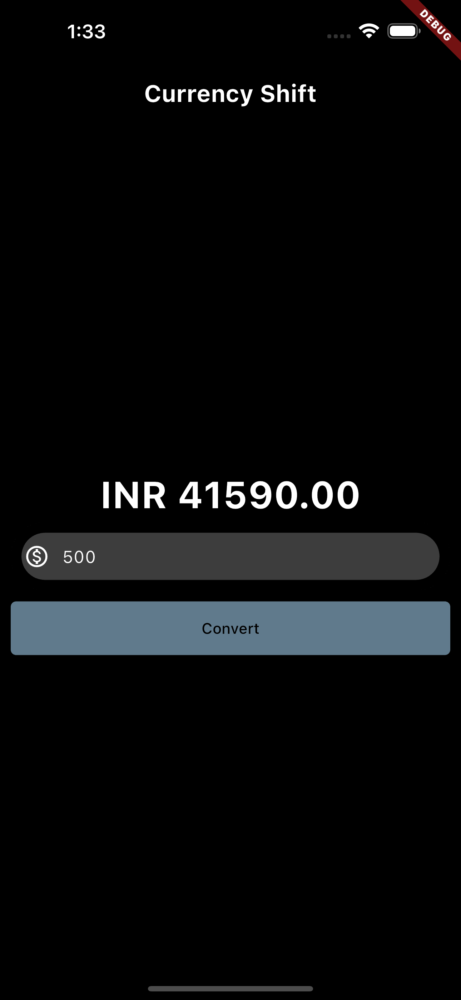
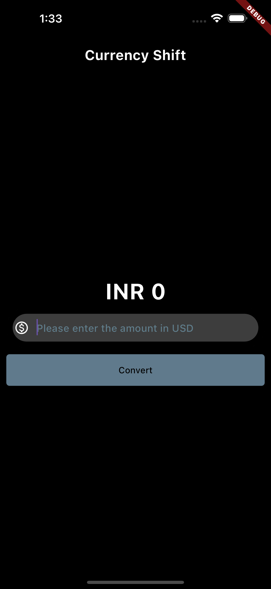

Currency Converter is a user-friendly Flutter application that seamlessly operates on both iOS and Android devices, as well as a web application for convenient access from any browser. With a sleek and intuitive design, this app empowers users to effortlessly convert currencies, making financial transactions and travel planning a breeze.

# Screenshot of the Real-time Application

